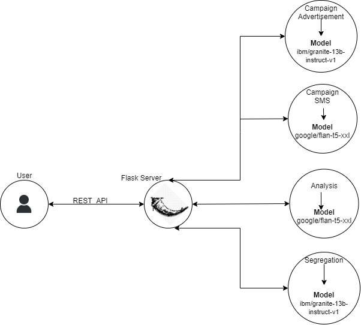

[](https://www.apache.org/licenses/LICENSE-2.0) [](https://developer.ibm.com/callforcode/solutions/projects/get-started/)

# E-Waste Manage Assist/ Waste Warriors

- [E-Waste Manage Assist/ Waste Warriors](#e-waste-manage-assist-waste-warriors)
  - [Project summary](#project-summary)
    - [Revolutionizing e-waste management using solution based out of generative AI](#revolutionizing-e-waste-management-using-solution-based-out-of-generative-ai)
    - [How our technology solution can help](#how-our-technology-solution-can-help)
    - [Our idea](#our-idea)
  - [Technology implementation](#technology-implementation)
    - [IBM AI service(s) used](#ibm-ai-services-used)
    - [Other technology used](#other-technology-used)
    - [Solution architecture](#solution-architecture)
  - [Presentation materials](#presentation-materials)
    - [Solution demo video](#solution-demo-video)
    - [Project development roadmap](#project-development-roadmap)
  - [Additional details](#additional-details)
    - [How to run the project](#how-to-run-the-project)
    - [Live demo](#live-demo)
  - [About this template](#about-this-template)
    - [Contributing](#contributing)
    - [Versioning](#versioning)
    - [Authors](#authors)
    - [License](#license)
    - [Acknowledgments](#acknowledgments)

_INSTRUCTIONS: Complete all required deliverable sections below._

## Project summary

### Revolutionizing e-waste management using solution based out of generative AI

Within factory environments, eliminating the need for human intervention and reducing the risk of hazardous exposure.
Our solution harnesses Generative AI to automate the process, enabling robots to accurately classify and segregate e-waste.
Simultaneously gathering data to predict and manage future e-waste generation, thereby promoting workplace safety and environmental sustainability.

### How our technology solution can help

- Public Awareness about Health Hazards of E-waste.
- Reduce risk of human exposure to e-waste by automating e-waste material segregation.
- Predict Future E-waste Generation.

### Our idea

The global issue of electronic waste, or e-waste, poses significant environmental and health risks. As the proliferation of electronic devices continues, responsible e-waste management is of paramount importance. In response to this challenge, we have developed a groundbreaking solution that combines the power of Generative AI to serve three critical purposes:

**1. Generating Awareness through AI-Generated Advertisements:**
The first facet of our solution focuses on generating awareness about e-waste management among the general public. Electronic waste contains hazardous materials that, when improperly disposed of, can harm the environment and human health. Our AI-driven system creates tailored and impactful advertisements to educate the public on the importance of recycling and responsible e-waste disposal. By harnessing Generative AI, these advertisements can be customized to target specific audiences, making the message more relatable and engaging.

**2. Factory E-Waste Segregation :**
The third and most innovative component of our solution is the application of Generative AI in factory environments to automate the segregation of e-waste, eliminating the need for human intervention. Once sorted, the e-waste is placed in specific racks for further processing or recycling. This automated system enhances workplace safety by reducing human exposure to hazardous materials, while also increasing operational efficiency in managing e-waste within the factory environment. E-waste segregation data will be used further in Predictive Insights and Analysis based on certain assumptions.

**3. Data Collection and Validation for Predictive Insights:**
The second aspect of our solution involves capturing data from various public sources online and validating this data to gain insights into future e-waste generation trends. Accurate data is crucial for developing sustainable waste management strategies. Our system aggregates data from sources such as government reports, industry publications, and public databases. It then employs advanced data validation techniques to ensure the information's reliability and accuracy. This validated data is analyzed to predict and understand the future trajectory of e-waste generation, helping organizations and policymakers make informed decisions regarding e-waste management and resource allocation.

**How the Three Components Work Together:**
The synergy between these three components is what makes our solution truly remarkable. The awareness generated through AI-driven advertisements not only educates the public but also promotes responsible e-waste disposal practices. Concurrently, the data collected and validated from public sources helps organizations anticipate the scale of e-waste challenges they will face. This predictive insight allows for better planning and resource allocation, ensuring that e-waste is managed efficiently.

In factory environments, the AI-powered robotic segregation system takes this a step further by automating the sorting process, reducing the risk to human workers and increasing efficiency. The data-driven approach also extends to factory operations, where the system can track the types and quantities of e-waste processed, helping organizations better manage their e-waste streams and make informed decisions on recycling and disposal methods.

**Conclusion:**
Our triple-purpose solution is a comprehensive and forward-thinking approach to e-waste management. By combining Generative AI to raise awareness, collect and validate data for predictive insights, and automate e-waste segregation in factory settings, we address the e-waste challenge at various levels. Our goal is to create a more sustainable and responsible approach to electronic waste management that benefits the environment, public health, and the global community as a whole. With this integrated approach, we aim to pave the way for a greener, cleaner, and safer future for all.


## Technology implementation

### IBM AI service(s) used

[IBM Research BAM](https://bam.res.ibm.com/)</br>
  We're using following generative AI models from IBM Research BAM laboratory.
- ibm/granite-13b-instruct-v1
- google/flan-t5-xxl


### Other Model used</br>
[LangChain](https://docs.langchain.com/docs/)
Below model is used in e-waste analysis module.
- langchain_model

### Other technology used</br>
- Python
- Flask

### Solution architecture

Diagram and step-by-step description of the flow of our solution:



1. This implementation is currently driven by API calls through POSTMAN. 
2. User calls the relevant REST APIs which will call the models.

## Presentation materials

_INSTRUCTIONS: The following deliverables should be officially posted to your My Team > Submissions section of the [Call for Code Global Challenge resources site](https://cfc-prod.skillsnetwork.site/), but you can also include them here for completeness. Replace the examples seen here with your own deliverable links._

### Solution demo video

[Watch the video]

### Project development roadmap

The project currently does the following things.

- **E-waste Awareness campaign**</br>
Here, we provide a fact sheet about electronic devices and overview about e-waste recycling and use `granite-13b-instruct-v1` model to create advertisement campaign contents initially intended to be displayed at retailers end. Also, we're generating SMS contents from `google/flan-t5-xxl` model

- **Segregation of e-waste materials or devices at recycler facility center**</br>
Here, to segregate items received at recycler we train the model `ibm/granite-13b-instruct-v1` by providing rack identifier examples to store the received item and label it.

- **Data Collection and Validation for Predictive Insights** </br>
Here, our process will we get the data from `ibm/granite-13b-instruct-v1` model and have certain assumptions based on which we will predict the e-waste generation for future perpective.

### In the future we plan to...
- **Integrate Segregation Model with Robots** </br>
  The segregation model will be integrated with Robots in Recycler plants to safeguard human exposure to hazardous componets that can cause major health issues.

- **Mobile Application for Public Engagement** </br>
  Create user-friendly mobile application that enables individuals to easily schedule e-waste pickups, receive notificatios about nearby collection points and access educational resources on responsible e-waste disposal.

- **Sentiment Analysis for Ad Campaings** </br>
  Based on the user feedback captured at various retail centers, NLP will be used to analyze the sentiments of user feedback to tailor advertising campaigns effectively. By understanding the public sentiments, organizations can create advertisements that resonate with the audience and drive positive actions.
- **Augmented Reality Training** </br>
  Integrate with AR application that provide step-by-step instructions for safely disasembling electronic devices.  
  
  
See below for our proposed schedule on next steps after Call for Code 2023 submission.


## Additional details

_INSTRUCTIONS: The following deliverables are suggested, but **optional**. Additional details like this can help the judges better review your solution. Remove any sections you are not using._

### How to run the project
#### Pre-Requisites
1. Create env file having credentials to connect to genai api
  ```
  GENAI_KEY="<your_key_here>"
  GENAI_API="https://bam-api.res.ibm.com/v1"
  ```
2. Install python dependecies</br>
`pip install -r requirements.txt`</br>

3. Execute following command to start flask webserver on port 8080</br>
`flask --app caller run --debug --port 8080`</br>

##### Common issues and fixes while troubeleshooting above flask run -  
1. ImportError for class "Credentials", "Model" in Lib\site-packages\genai\extensions\langchain\llm.py- </br>
fix: Change the import statement as "from genai.credentials import Credentials" and "from genai.model import Model"
2. ImportError for "version" in Python file-</br>
fix: Check the error in the respective python file and replace with the name "__version__".

#### Executing API calls. 
1. **Awareness Campaign**</br>
   a. Generate Advertisement:</br>
     API call: `/EwasteCampaignAdvertise`</br>
     Sample API response below:</br>
     ```
      - E-waste recycling is a process of collecting, transporting, and processing discarded electronic devices.
      - E-waste recycling facilities are specialized facilities designed to manage and process electronic waste.
      - E-waste includes discarded electronic devices like smartphones, computers, laptops, TVs, printers, and more.
      - These facilities play a crucial role in preventing environmental damage caused by improper disposal of electronic waste.
      - Electronic waste contains hazardous materials like lead, mercury, and cadmium, which can harm the environment if not managed properly.
      - E-waste recycling centers are equipped with specialized equipment to safely dismantle and process electronic devices.
      - Valuable components like precious metals (gold, silver, copper) are separated for reuse in new electronics.
      - E-waste recycling centers often collaborate with certified disposal facilities to manage hazardous waste properly.
        For more information visit XYZ.com 
     ```
   b. Generate SMS:<br>
     API call: `/EwasteCampaignSms`</br>
     Sample API response below:</br>
     ```
     Health Hazards. E-waste is hazardous to human health. E-waste recycling is a process of collecting, transporting, and processing discarded electronic devices.         E-waste recycling facilities are specialized facilities designed to manage and process electronic waste. For more information visit XYZ.com
     ```
3. **Analysis**</br>
     API call: `/smartphone_analysis`</br>
     Sample API response below:</br>
     ``` 
    {
        "AI Model value for Total EWaste per year in India": "1.6 million tonnes",
        "AI Model value for Percent Mobile contribution to EWaste": "5%",
        "Total Mobile EWaste per year": "0.08 Million Tons",
        "No of States in India": 28,
        "Avg Mobile EWaste expected from a state per year": "2857.14 Tons",
        "Say Mobile EWaste collected at seggregation facility for a state": "X Million Tons",
        "Analysis": "Average Mobile EWaste is expected at state level is 2857.14 Tons, but actual value is X Tons The shortage suggests a  better campaiging strategy          for mobile EWaste collection at state level"
    }
     ```
4. **Segregation**</br>
   API call: /seggregation
   Provide input JSON format with a list of devices by making POST call to above API.</br>
   Sample API response below:</br>
   Example inut JSON file as - </br>
   ```
   {
     "devices": ["Calculator","Solar_panel","HDMI_cable","Iphone"]
   }   
   ```
   Output:</br>
   ```
   {
      "Calculator": " Miscellaneous Electronic Devices,May contains battries, Can be reclaimed,Store at Rack-18",
      "Solar_panel": " Renewable Energy Equipment,may contains photovoltaic substance, Can be reclaimed,Store at Rack-20",
      "HDMI_cable": " Cables and Wiring, Can be reclaimed,Store at Rack-16",
      "Iphone": " Phone, Might contains user data, which need to be erased before refurbishing or recycling,Store at Rack-8",
   }
   ```
INSTRUCTIONS: In this section you add the instructions to run your project on your local machine for development and testing purposes. You can also add instructions on how to deploy the project in production.

### Live demo

You can find a running system to test at...

See our [description document](./docs/DESCRIPTION.md) for log in credentials.

---

_INSTRUCTIONS: You can remove the below section from your specific project README._

## About this template

### Contributing

Please read [CONTRIBUTING.md](CONTRIBUTING.md) for details on our code of conduct, and the process for submitting pull requests to us.

### Versioning

We use [SemVer](http://semver.org/) for versioning. For the versions available, see the [tags on this repository](https://github.com/your/project/tags).

### Authors

<a href="[https://github.com/Call-for-Code/Project-Sample/graphs/contributors](https://github.com/Omqarrr/ewaste-manage-assist/graphs/contributors)">
  
</a>

### License

This project is licensed under the Apache 2 License - see the [LICENSE](LICENSE) file for details.

### Acknowledgments

- Based on [IBM BAM Res](https://bam.res.ibm.com/).
